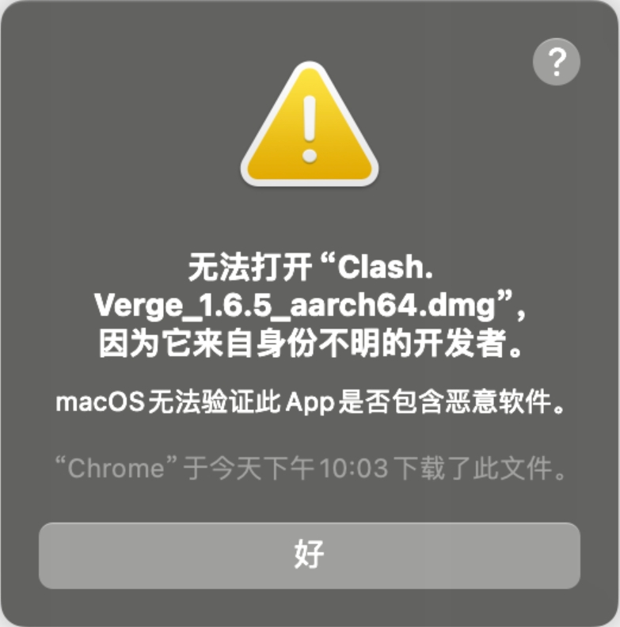
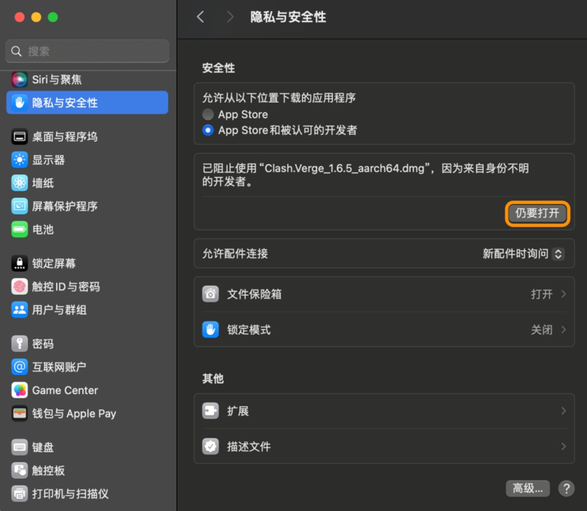
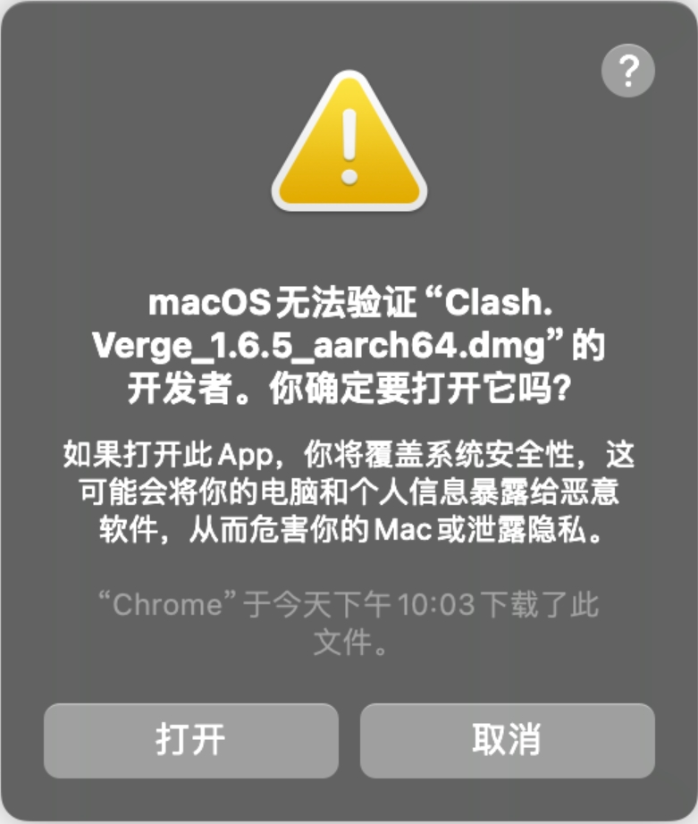
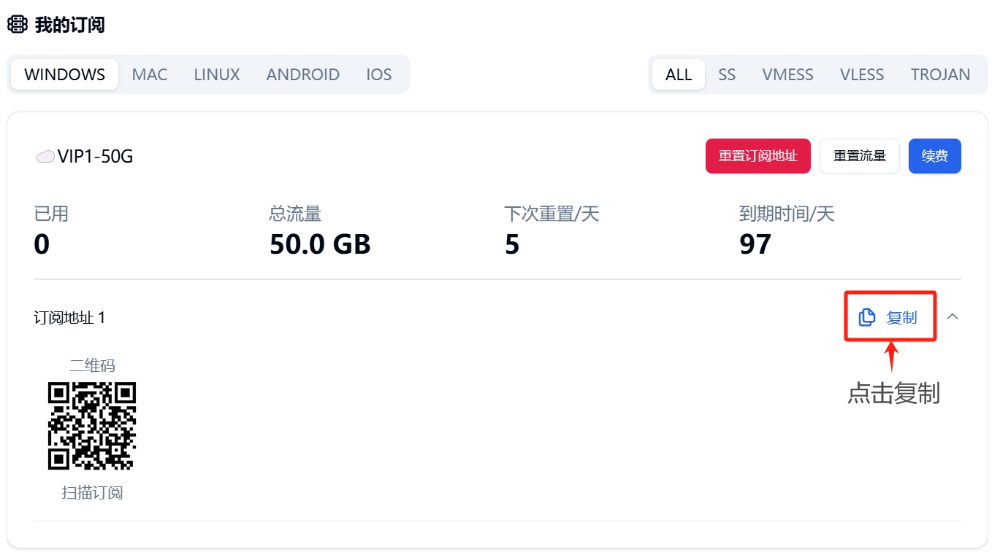
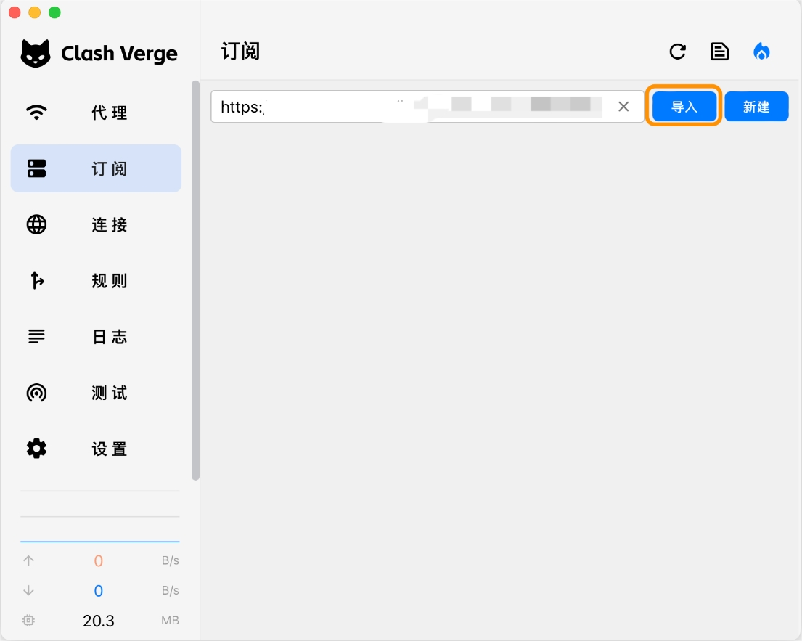
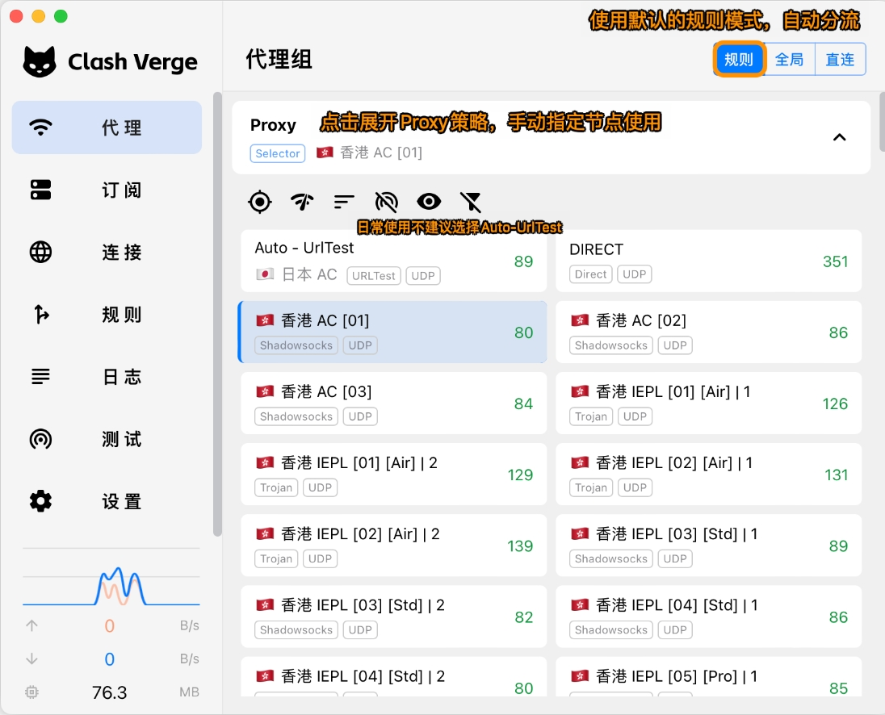
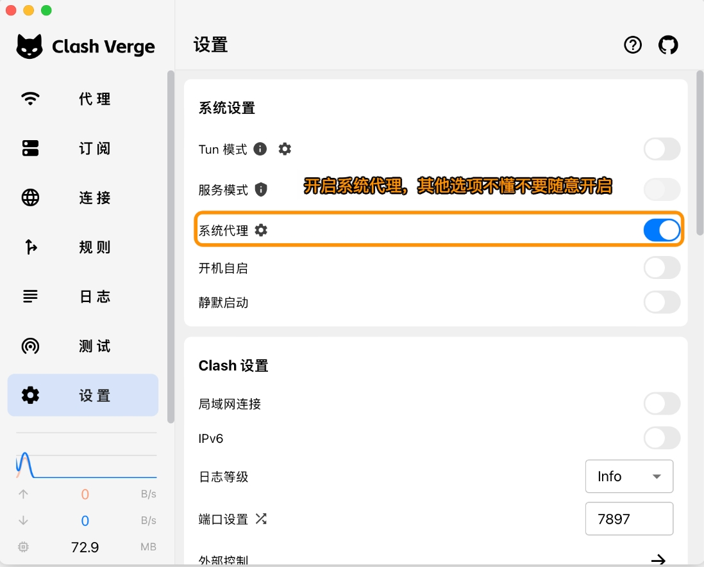
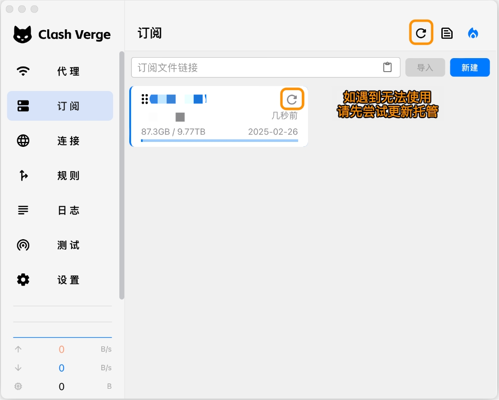

# Clash Verge

[Clash Verge](https://github.com/clash-verge-rev/clash-verge-rev) is a cross-platform GUI client for Clash kernel, supporting Windows, Linux, and macOS systems, with powerful traffic routing capabilities.

## Requirements

> ⚠️ System Requirements

- Operating System: macOS 10.5 or higher
- Software Version: Clash Verge for macOS
- Compatible Devices: MacBook / iMac / Mac Pro

## Download

[Download Address 1](https://github.com/clash-verge-rev/clash-verge-rev/releases/download/v2.5.1/Clash.Verge_2.5.1_aarch64.dmg)

[Download Address 2](https://github.com/clash-verge-rev/clash-verge-rev/releases/download/v2.5.1/Clash.Verge_2.5.1_x64.dmg)

[Download Address 3](https://github.com/clash-verge-rev/clash-verge-rev/releases/download/v2.5.1/Clash.Verge_2.5.1_x64.dmg)

### Important Notice

📢 macOS Security Alert Solution
Starting from macOS 10.15, due to enhanced system security, you may receive "Developer Cannot Be Verified" or "App Is Damaged" alerts on first launch. Please follow these steps:

---

## Configuration Guide

### 1. Import Configuration

---

### 2. Update Configuration

---

> 📅 Last Updated: July 10, 2025 | ⚔️ Applicable Version: Clash Verge 1.7.7
